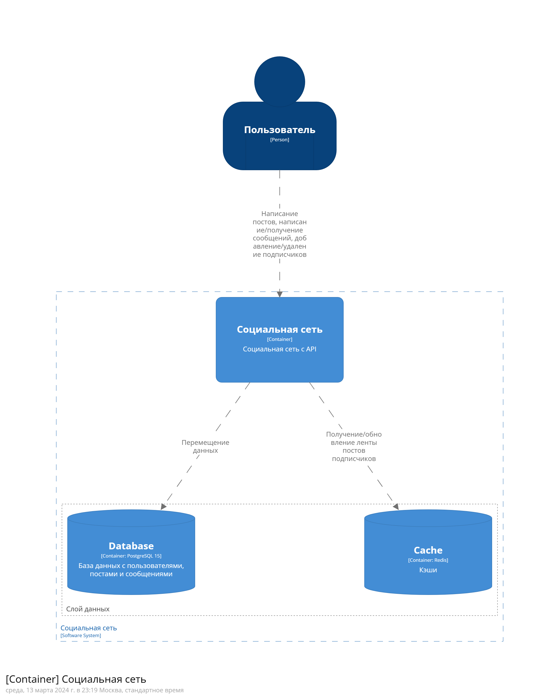

# МАИ Архитектура высоконагруженных систем

## Вариант и постановка задачи

В рамках выполнения практической работы необходимо спроектировать и реализовать приложение, которое будет осуществлять хранение, обработку и предоставление доступа к данным, согласно варианту задания.

## Социальная сеть

Приложение должно содержать следующие данные:
- Пользователь
- Стена 
- Сообщения чата (PtP)
Реализовать API:
- Создание нового пользователя
- Поиск пользователя по логину
- Поиск пользователя по маске имя и фамилии
- Добавление записи на стену
- Загрузка стены пользователя
- Отправка сообщения пользователю
- Получение списка сообщения для пользователя

Полная архитектура: [Здесь](./arch_readme.md)